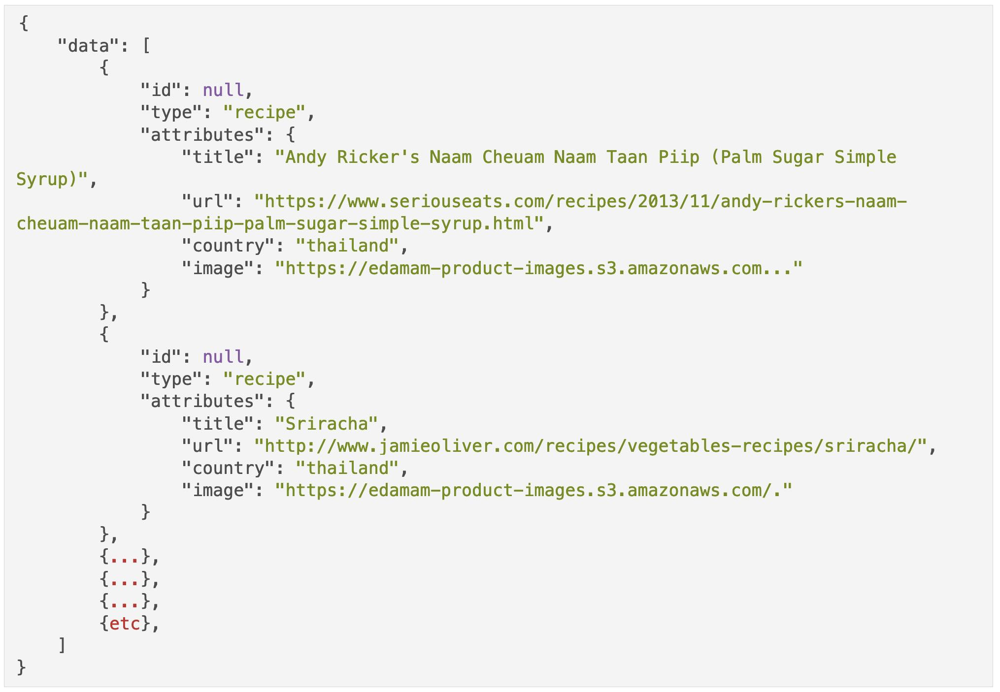

<!-- Improved compatibility of back to top link: See: https://github.com/marchandmd/final_project/pull/73 -->

<a name="readme-top"></a>

<!--
*** Thanks for checking out the final_project. If you have a suggestion
*** that would make this better, please fork the repo and create a pull request
*** or simply open an issue with the tag "enhancement".
*** Don't forget to give the project a star!
*** Thanks again! Now go create something AMAZING! :D
-->

<!-- PROJECT SHIELDS -->
<!--
*** I'm using markdown "reference style" links for readability.
*** Reference links are enclosed in brackets [ ] instead of parentheses ( ).
*** See the bottom of this document for the declaration of the reference variables
*** for contributors-url, forks-url, etc. This is an optional, concise syntax you may use.
*** https://www.markdownguide.org/basic-syntax/#reference-style-links
-->

[![Contributors][contributors-shield]][contributors-url]
[![Forks][forks-shield]][forks-url]
[![Stargazers][stars-shield]][stars-url]
[![Issues][issues-shield]][issues-url]
[![MIT License][license-shield]][license-url]
[![LinkedIn][linkedin-shield]][linkedin-url]

<!-- PROJECT LOGO -->
<br />
<div align="center">

  <h1 align="center">Recipes API</h1>

  <p align="center">
    <h3>Exposing an API to function within a Service-Oriented Architecture</h3>
    <br />
    
    <br />
    <a href="https://backend.turing.edu/module3/projects/lunch_and_learn/"><strong>Explore the docs »</strong></a>
    <br />
    <br />
    <a href="https://github.com/marchandmd/final_project">View Demo</a>
    ||
    <a href="https://github.com/marchandmd/final_project/issues">Report Bug</a>
    ||
    <a href="https://github.com/marchandmd/final_project/issues">Request Feature</a>
  </p>
</div>

<!-- TABLE OF CONTENTS -->
<details>
  <summary>Table of Contents</summary>
  <ol>
    <li>
      <a href="#about-the-project">About The Project</a>
      <ul>
        <li><a href="#built-with">Built With</a></li>
      </ul>
    </li>
    <li>
      <a href="#getting-started">Getting Started</a>
      <ul>
        <li><a href="#prerequisites">Prerequisites</a></li>
        <li><a href="#installation">Installation</a></li>
      </ul>
    </li>
    <li><a href="#usage">Usage</a></li>
    <li><a href="#roadmap">Roadmap</a></li>
    <li><a href="#contributing">Contributing</a></li>
    <li><a href="#license">License</a></li>
    <li><a href="#contact">Contact</a></li>
    <li><a href="#acknowledgments">Acknowledgments</a></li>
  </ol>
</details>

<!-- ABOUT THE PROJECT -->

## About The Project

For this project, I was supposed to pretend that I am a back-end developer working on a team that is building an application to search for cuisines by country, and provide opportunity to learn more about that countries culture. This app will allow users to search for recipes by country, favorite recipes, and learn more about a particular country.

Your team is working in a service-oriented architecture. The front-end will communicate with your back-end through an API. Your job is to expose that API that satisfies the front-end team’s requirements.

What did I learn building this:

- Expose an API that aggregates data from multiple external APIs
- Expose an API that requires an authentication token
- Expose an API for CRUD functionality
- Determine completion criteria based on the needs of other developers
- Test both API consumption and exposure, making use of at least one mocking tool (VCR, Webmock, etc).


<p align="right">(<a href="#readme-top">back to top</a>)</p>

### Built With

-   [![Ruby][ruby.com]][ruby-url]
-   [![Rspec][rspec.com]][rspec-url]
-   [![Rails][rails.com]][rails-url]

<p align="right">(<a href="#readme-top">back to top</a>)</p>

<!-- GETTING STARTED -->

## Getting Started

### Prerequisites

ruby v2.7.4
postman

### Installation

1. Clone the repo
    ```sh
    git clone https://github.com/marchandmd/final_project.git
    ```
2. Install packages
    ```sh
    bundle
    ```

<p align="right">(<a href="#readme-top">back to top</a>)</p>

<!-- USAGE EXAMPLES -->

## Usage

1. `cd` into the directory
2. endpoints exposed, which can be explored with Postman are as follows:

   - `GET /api/v1/recipes?country=<country>`
   - `GET /api/v1/learning_resources?country=<country>`
   - `POST /api/v1/users`
   - `POST /api/v1/favorites`
   - `GET /api/v1/favorites?api_key=<api_key_here>`

Interact with the app!

Notes about the final endpoint: the api_key for a specific user is automagically generated during the creation of a user; To test that endpoint, it's suggested to create a user first and use that endpoint after favorites have been determined. 

<p align="right">(<a href="#readme-top">back to top</a>)</p>

<!-- ROADMAP -->

## Roadmap

- [ ] Develop front-end interface and layout
- [ ] add endpoints
- [ ] log in
- [ ] additional user stories


See the [open issues](https://github.com/marchandmd/final_project/issues) for a full list of proposed features (and known issues).

<p align="right">(<a href="#readme-top">back to top</a>)</p>

<!-- CONTRIBUTING -->

## Contributing

Contributions are what make the open source community such an amazing place to learn, inspire, and create. Any contributions you make are **greatly appreciated**.

If you have a suggestion that would make this better, please fork the repo and create a pull request. You can also simply open an issue with the tag "enhancement".
Don't forget to give the project a star! Thanks again!

1. Fork the Project
2. Create your Feature Branch (`git checkout -b feature/AmazingFeature`)
3. Commit your Changes (`git commit -m 'Add some AmazingFeature'`)
4. Push to the Branch (`git push origin feature/AmazingFeature`)
5. Open a Pull Request

<p align="right">(<a href="#readme-top">back to top</a>)</p>

<!-- LICENSE -->

## License

Distributed under the MIT License. See `LICENSE.txt` for more information.

<p align="right">(<a href="#readme-top">back to top</a>)</p>

<!-- CONTACT -->

## Contact

Michael Marchand - MichaelDavidMarchand@gmail.com

Project Link: [https://github.com/MarchandMD/final_project](https://github.com/marchandmd/final_project)

<p align="right">(<a href="#readme-top">back to top</a>)</p>

<!-- ACKNOWLEDGMENTS -->

## Acknowledgments

Use this space to list resources you find helpful and would like to give credit to. I've included a few of my favorites to kick things off!

-   [Choose an Open Source License](https://choosealicense.com)
-   [GitHub Emoji Cheat Sheet](https://www.webpagefx.com/tools/emoji-cheat-sheet)
-   [Img Shields](https://shields.io)
-   [GitHub Pages](https://pages.github.com)
-   [Rubocop](https://rubocop.org/)

<p align="right">(<a href="#readme-top">back to top</a>)</p>

<!-- MARKDOWN LINKS & IMAGES -->
<!-- https://www.markdownguide.org/basic-syntax/#reference-style-links -->

[contributors-shield]: https://img.shields.io/github/contributors/marchandmd/final_project.svg?style=for-the-badge
[contributors-url]: https://github.com/marchandmd/final_project/graphs/contributors
[forks-shield]: https://img.shields.io/github/forks/marchandmd/final_project.svg?style=for-the-badge
[forks-url]: https://github.com/marchandmd/final_project/network/members
[stars-shield]: https://img.shields.io/github/stars/marchandmd/final_project.svg?style=for-the-badge
[stars-url]: https://github.com/marchandmd/final_project/stargazers
[issues-shield]: https://img.shields.io/github/issues/marchandmd/final_project.svg?style=for-the-badge
[issues-url]: https://github.com/marchandmd/final_project/issues
[license-shield]: https://img.shields.io/github/license/marchandmd/final_project.svg?style=for-the-badge
[license-url]: https://github.com/marchandmd/final_project/blob/master/LICENSE.txt
[linkedin-shield]: https://img.shields.io/badge/-LinkedIn-black.svg?style=for-the-badge&logo=linkedin&colorB=555
[linkedin-url]: https://linkedin.com/in/mmarchand1/
[product-screenshot]: images/screenshot.png
[bootstrap.com]: https://img.shields.io/badge/Bootstrap-563D7C?style=for-the-badge&logo=bootstrap&logoColor=white
[bootstrap-url]: https://getbootstrap.com
[ruby.com]: https://img.shields.io/badge/ruby-v2.7.4-red
[ruby-url]: https://ruby-doc.org/core-2.7.2/
[rspec.com]: https://img.shields.io/badge/rspec-v3.12-success
[rspec-url]: https://rspec.info/documentation/
[rails.com]: https://img.shields.io/badge/rails-v5.2-success
[rails-url]: https://guides.rubyonrails.org/v5.2/
